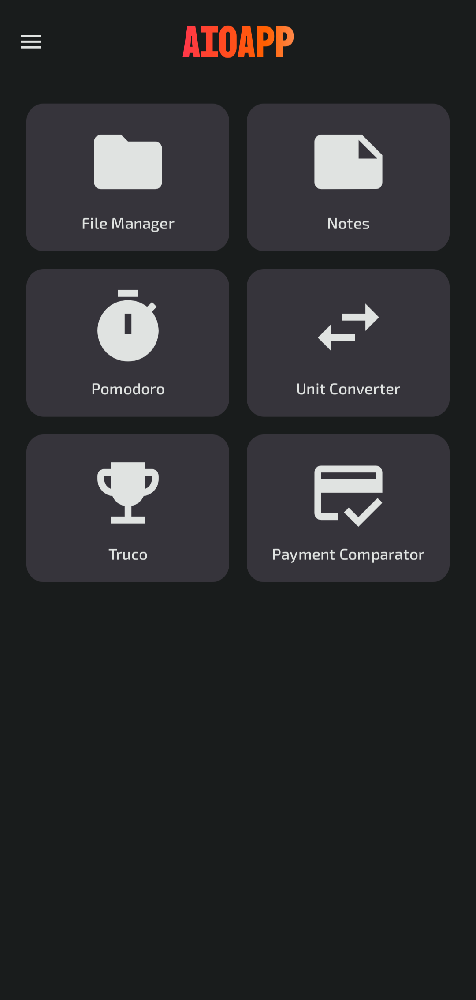
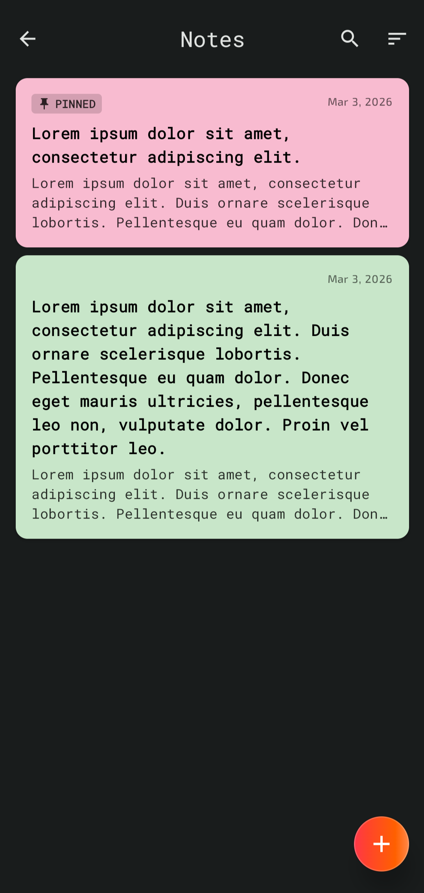

# 📱 AIOApp
AIOApp is a modular Android application that integrates multiple productivity and utility tools into a single, scalable project.

---

## ✨ Features

### 📝 Notes Manager
- Create, edit, and delete notes
- Local persistence using Room
- MVVM architecture

### ⏱ Pomodoro Timer
- Customizable Pomodoro sessions
- Foreground Service support for background execution
- State handled via ViewModel

### 💱 Currency Converter
- Real-time exchange rates via external API
- Retrofit + Gson integration
- Repository pattern for data abstraction

### 📐 Unit Converter
- Convert between multiple measurement units
- Persistent unit order customization

### 💳 Payment Comparator
- Compare different payment options
- Calculate final costs and differences

### 🗂 File Manager
- File browsing using Android DocumentFile API
- Scoped storage compatible

### 🃏 Truco Point Tracker
- Track scores for Truco games
- Persistent game state stored locally

### ⚙️ Settings
- User preferences stored using DataStore
- Multi-language support (English / Spanish)

---

## 🏗 Architecture

This project follows modern Android architecture guidelines:

- MVVM (Model–View–ViewModel)
- Repository Pattern
- Dependency Injection with Hilt
- Single-Activity architecture
- Navigation Compose
- Separation of concerns

---

## 🧩 Tech Stack

| Category | Technology |
|----------|------------|
| Language | Kotlin 2.0 |
| UI | Jetpack Compose |
| Architecture | MVVM |
| Database | Room |
| Networking | Retrofit + Gson |
| Dependency Injection | Hilt |
| Navigation | Navigation Compose |
| Preferences | DataStore |
| Image Loading | Coil |
| Build System | Gradle (KTS) |

---

## 📦 Configuration

| Property | Value |
|----------|-------|
| Min SDK | 26 |
| Target SDK | 36 |
| Compile SDK | 36 |
| Java Version | 11 |

---

## 🚀 Getting Started

### 1️⃣ Clone the repository

```bash
git clone https://github.com/LautaroBudin/AIOApp.git
```

### 2️⃣ Open in Android Studio

- Android Studio Hedgehog or newer recommended
- Sync Gradle

### 3️⃣ Build & Run

Run the app on:
- Emulator (API 26+)
- Physical Android device

---

## 🌍 Localization

Supported languages:
- English
- Spanish

Localization is handled using Android resource qualifiers:

```
values/
values-es/
```

---

## 🧪 Testing

Includes:

- Unit tests
- Android instrumentation tests
- Hilt testing support

Run tests with:

```bash
./gradlew test
./gradlew connectedAndroidTest
```

---

## 📸 Screenshots

```markdown


```
